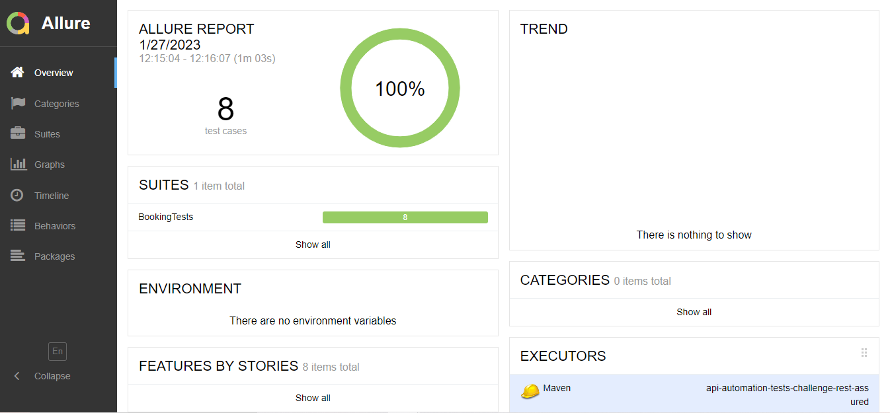

#  DESAFIO DE PROJETO  #

## GFT ##

### API AUTOMATION REST ASSURED ###

## OBJETIVO DO PROJETO ##
✨ Neste projeto foi criado requests, variaveis e testes utilizando o Postman conforme collection anexada 

Também foi explorado o o framework RestAssured + JUnit e a realizado a geração de  reports com o Allure Framework

               API BASE
✨ Restful-booker

               FRAMEWORKS/TOOLS
✨ RestAssured

✨ Json Server(Javascript)

✨ Intellij e Visual Studio Code

✨ Allure Framework

